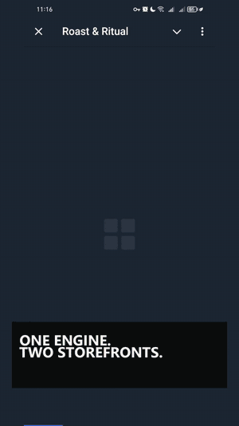
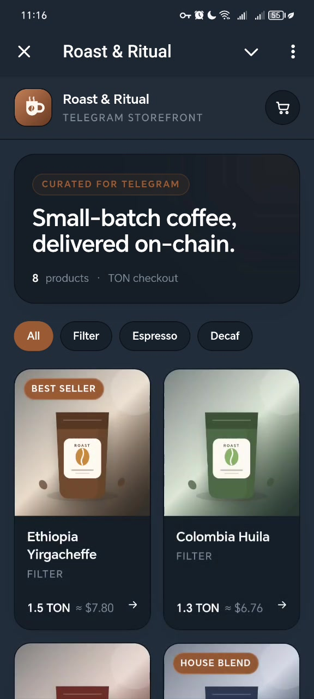
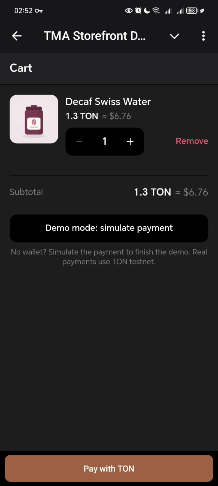
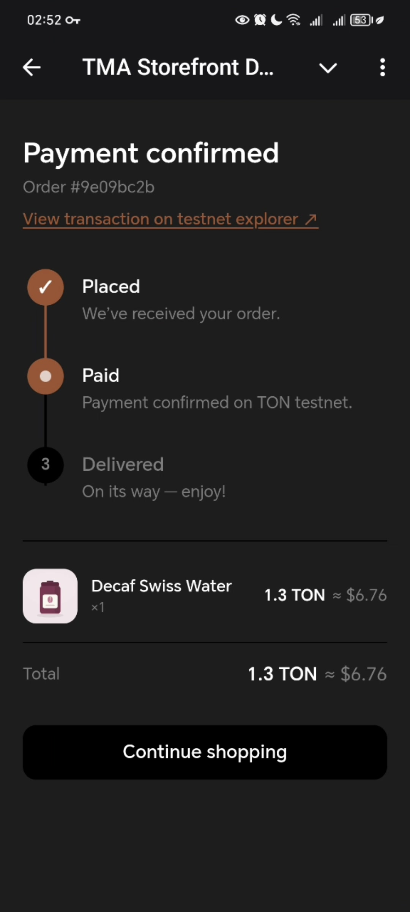

# Telegram Mini App Storefront

[](https://github.com/MmDZ21/tma-storefront-demo/actions/workflows/ci.yml)
[](./LICENSE)

A polished **Telegram Mini App storefront** with **TON (testnet) payments** — a portfolio
piece and a **re-skinnable demo template**. Native Telegram feel, automatic dark/light
theming from the client, a full purchase funnel, and a one-file personalization layer.

> **Status — feature-complete, deployed to testnet.** Every screen in the funnel is built,
> typechecked, and tested (113 tests); the TON payment round-trip and `startapp` deep links
> are verified on-device. What remains before the repo goes public is tracked in
> [`PUBLISH-CHECKLIST.md`](./PUBLISH-CHECKLIST.md): final push checks and the documented
> server-side hardening (see _Security & trust boundary_).

## Demo



🎬 **Short walkthrough:** [watch the 45-second MP4](./docs/media/walkthrough.mp4)

| Catalog | Cart + TON checkout | Order status |
| --- | --- | --- |
|  |  |  |

> 🔗 **Live app:** <https://tma-storefront-demo.pages.dev> — in a plain browser you'll get
> the QR fallback page; the storefront itself opens inside Telegram via the bot:
> **<https://t.me/tma_demo_bot/store>** (payments on TON **testnet**).

## Features

- **Full funnel** — catalog → product → cart → checkout → **animated** placed → paid →
  delivered order status.
- **Real TON payments (testnet)** via TON Connect: connect wallet → send the cart total to
  the demo address, tagged with a per-order comment nonce; the order confirms when the
  testnet indexer sees the matching transfer. _Mainnet / fiat / Telegram Stars are out of
  scope by design._
- **No-wallet path** — a visible "Demo mode: simulate payment" button so a viewer without a
  wallet still completes the funnel. The demo never dead-ends.
- **Native Telegram UX** — theme, viewport, haptics, and the MainButton/BackButton via
  [`@telegram-apps/sdk-react`](https://docs.telegram-mini-apps.com), with in-app
  equivalents so the funnel also works in any browser.
- **Automatic theming** — every color flows from Telegram's `themeParams` into a semantic
  token layer; dark/light switches live, mid-session. Zero hardcoded color.
- **Re-skin in ~20 minutes** — all branding lives in one validated JSON file
  ([`PERSONALIZE.md`](./docs/PERSONALIZE.md)).
- **Outside-Telegram fallback** — opened in a normal browser, a slim branded page with a QR
  code + deep link to the bot.
- **Bot launcher** — the live BotFather Mini App link opens the storefront directly; an optional
  minimal grammY launcher is included for `/start` → web_app button + chat menu button.

## Architecture

```
        Telegram client (themeParams · viewport · launch data · native buttons · haptics)
                                   │
                                   ▼
   features/theming + features/telegram   ← the only layers that touch the Telegram SDK
     • themeParams.bindCssVars() → --tg-theme-* → semantic tokens (with browser fallbacks)
     • brand.json (zod-validated) → --brand-* CSS variables
     • { inTelegram, nativeControls } context → native vs in-app controls
                                   │
                                   ▼
       app/ routes  (HashRouter: Catalog · Product · Cart · Status · outside-TG Fallback)
         • startapp deep link → route, normalised before the router mounts
         • shared/ui — CTAs, Price, Skeleton, Stepper      • entities/ — cart + order (Zustand)
         • features/ton-pay — TON Connect adapter (lazy-loaded at the cart route)
                                   │
                                   ▼
            public/config/*.json   ← brand + products = the personalization layer

   bot/index.ts  (grammY, separate Node process) — launches the Mini App; not in the web bundle
```

The TON Connect SDK is **code-split into the cart chunk**, so catalog/product first paint
stays light (~98 KB gzip; budget 250). Design notes and every judgment call are logged in
[`DECISIONS.md`](./DECISIONS.md).

## Tech stack — and why

- **Vite 6 + React 18 + TypeScript (strict, zero `any`)** — fast HMR, first-class TS, and
  easy route-level code-splitting (used to keep TON Connect and the QR lib off first paint).
- **`@telegram-apps/sdk-react`** — the Mini Apps SDK: theme params, viewport, haptics, and
  the native Main/Back buttons. Kept behind two feature folders so screens never touch it raw.
- **`@tonconnect/ui-react`** (+ `@ton/core`) — the standard TON wallet-connection protocol;
  `@ton/core` builds the per-order payment comment. **Testnet only.**
- **Tailwind CSS v4 (CSS-first)** — design tokens bind directly to Telegram's theme CSS
  variables, so theming is automatic and there's zero hardcoded color.
- **Zustand** (cart/order) — minimal client state without a backend or boilerplate.
- **Zod** — validates the personalization JSON (`brand.json`/products) at the boundary, so a
  bad re-skin fails loudly instead of rendering broken.
- **HashRouter** — server-less static hosting (Cloudflare Pages) and refresh-safe, with a
  bootstrap that maps a Telegram `startapp` deep link to a route before the router mounts.
- **Vitest + Testing Library**, **ESLint 9 + Prettier**, **grammY** (bot).

## Getting started

```bash
npm install
npm run dev        # dev server; renders a mocked Telegram (dark) env in any browser
npm run build      # production build (tsc -b && vite build)
npm run test       # unit + integration tests (Vitest)
npm run lint       # ESLint
npm run typecheck  # tsc -b
npm run format     # Prettier write  (format:check verifies)
```

Dev tips: append `?fallback` to preview the outside-Telegram page; the in-app CTA stands in
for Telegram's native MainButton outside a real client.

**Real TON testnet payments (optional, for on-device QA).** Copy `.env.example` → `.env`
and set `VITE_TON_RECIPIENT_TESTNET` to a testnet address; an unconfigured build keeps the
Pay button disabled (Demo mode still works), so it fails loud rather than sending to a junk
address.

**Bot (optional).** Set `BOT_TOKEN` + `WEB_APP_URL` in `.env`, then `npm run bot` (runs the
launcher via long-polling).

## Personalize in ~20 minutes

All branding lives in [`public/config/brand.json`](./public/config/brand.json): shop name,
logo (image **or** emoji), accent color, currency, and the product-file pointer. Swap that
one file to re-skin the whole app. Two example skins ship in
[`public/config/`](./public/config):

| Skin | Logo | Accent |
| --- | --- | --- |
| `brand.coffee.json` | bundled SVG mark | warm espresso `#9a5b34` |
| `brand.sneakers.json` | bundled SVG image | vivid `#ff4d2e` |

```bash
# Re-skin to the sneaker store, then reload:
cp public/config/brand.sneakers.json public/config/brand.json
```

Product imagery ships as license-free, locally generated SVG pack shots (`npm run gen:images`) — and
swapping in **real photos is zero-code**: drop files into `/public` and point the product
`image` paths at them. Full checklist: **[`docs/PERSONALIZE.md`](./docs/PERSONALIZE.md)**.

## Security & trust boundary

This is a **client-only** demo (a backend is explicitly out of scope). It is honest about
what that means — full detail in [`server-notes.md`](./server-notes.md):

- **Payments are TESTNET only.** The on-chain amount is computed in exact nanotons (no float
  math on money), and each transfer carries a unique per-order comment nonce.
- **Confirmation is client-side and advisory.** The app polls a public testnet indexer
  (schema-validated, fail-closed). For **real money**, a backend must own the order + price
  and verify the on-chain receipt against a trusted node — the client cannot be the source
  of truth.
- **Telegram `initData` is not trusted.** It can't be validated in the browser; the app keys
  no security decision off it. `server-notes.md` §1 carries the server-side HMAC-SHA256
  validation snippet, and the client marks where the check belongs.

## Browser support

Targets **Tailwind CSS v4**, which relies on modern CSS (cascade layers, `@property`,
`color-mix()`):

> **Safari 16.4+ · Chrome/Edge 111+ · Firefox 128+**

An accepted tradeoff — the Telegram in-app WebView comfortably exceeds this floor.

## Project layout

```
src/
  app/         # screens: catalog/ product/ cart/ status/ fallback/ + Header + startParam
  shared/ui/   # Price, Skeleton, Stepper, PrimaryButton
  shared/      # formatting + nanoton money helpers
  entities/    # cart + order stores (Zustand)
  features/    # theming/ · telegram/ (native controls) · ton-pay/ (TON Connect adapter)
  config/      # zod-validated brand + products loaders, app config
public/config/ # brand.json (+ example skins) and product data
public/img/    # generated product illustrations
bot/           # grammY launcher (separate Node process)
docs/          # PERSONALIZE.md
scripts/       # build-time asset generators
```

## Known limitations (deliberate demo scope)

- **Client-only** — no backend; the on-chain payment confirmation is advisory/UX.
  [`server-notes.md`](./server-notes.md) documents the real trust boundary and exactly
  what moves server-side for real money.
- **In-memory cart & orders** — state lives in Zustand; a refresh clears it (persistence
  is out of scope per SPEC §4).
- **English-only UI** — the spec's EN + RU was descoped for v1; logged in
  [`DECISIONS.md`](./DECISIONS.md).
- **Static USD hint** — `currency.usdRate` in brand.json is a fixed display rate, not a
  price feed.
- **Testnet only** — mainnet, fiat, and Telegram Stars are out of scope by design.
- **~215 KB gzip cart chunk** — the TON Connect SDK, deliberately lazy-loaded (and
  prefetched at idle) so it never touches first paint.

## For clients

This project is a working reference for a branded Telegram Mini App storefront. It can be
re-skinned for a new catalog, visual identity, and launch path without rebuilding the core
funnel. See [`docs/CASE-STUDY.md`](./docs/CASE-STUDY.md) for the implementation story and
[`docs/OFFER.md`](./docs/OFFER.md) for the founding-client offer.

## License

[MIT](./LICENSE) — the repo is meant to be read, forked, and re-skinned.
